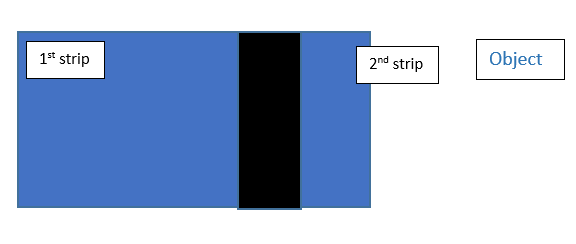

# Computer Vision in Swarm Robotics

<b>Software packages:</b> python 2.7.x,openCV 3.2.x

<b>Abstract:</b>
* This python code is used to identify the different colored objects , their centers and orientation.
* The OpenCV computer vision library has been used to find and characterize these strips.
* Using the contours class and its member functions we can easily find the center and slope of a single strip.
* Inbuilt OpenCV slope function for contours is not accurate enough. So, we used 2 strips to find slope accurately by properly aligning their centers.
* After getting the center and orientation of the object. we send it to the server in json format.

<b>Setup:</b>
* After installing python 2.7.x pip will be preinstalled. We can use pip to install other packages like numpy,scipy etc.
* You can follow the below link on how to install packages: https://www.youtube.com/watch?v=-llHYUMH9Dg.
* You can also install packages by downloading .whl files from this link http://www.lfd.uci.edu/~gohlke/pythonlibs/#numpy.
* To install a whl file, use ‘pip install C:/path_to_whl/name.whl’.You shouldn’t modify the whl file name after downloading it because pip uses the file name to identify compatibility.
* Install all the packages present in the code.
